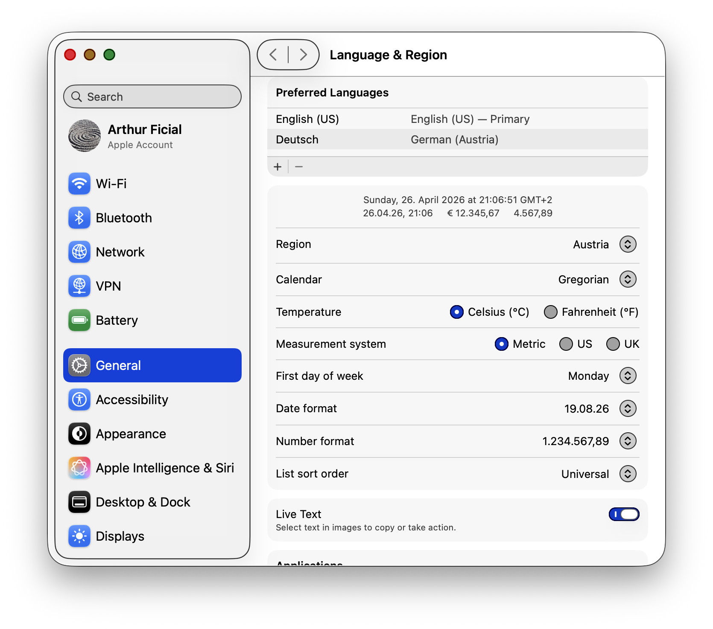
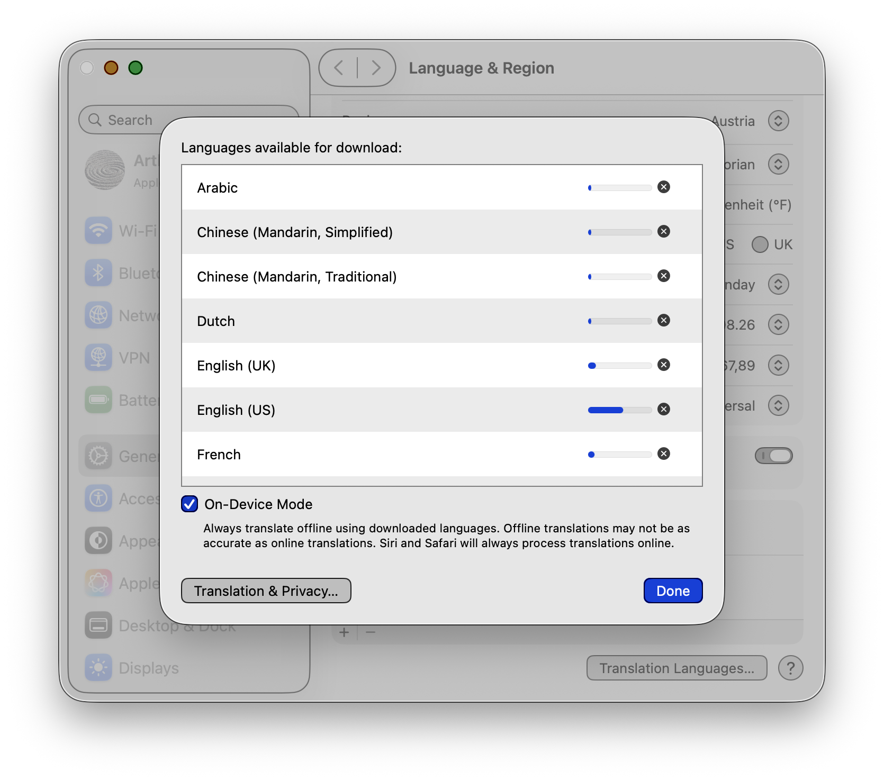

# Installing translation models on macOS Tahoe

`translate` needs Apple's on-device translation models to do real work. The models live in System Settings, not in `translate` itself, and they're downloaded from Apple's servers the first time you ask for them.

You only need to do this once per language pair, and only once per machine.

> **Why not `translate --install`?** On the current macOS Tahoe seed, the headless preparation API requires a SwiftUI host and so won't trigger the download from a CLI. Until that lands, the only reliable way to add a pair is the path below.

## Steps

### 1. Open System Settings → General → Language & Region

Or jump straight there:

```sh
open "x-apple.systempreferences:com.apple.Localization-Settings.extension"
```

You should see your preferred languages, region, calendar, and date / number formats.



### 2. Scroll to the bottom and click **Translation Languages…**

The button is below the "Live Text" toggle, near the bottom of the pane.

### 3. Pick the languages you want, click the download arrow, click **Done**

The dialog lists every language Apple's Translation framework supports on this OS. Click the download icon (right side of each row) to queue a model. The progress bar fills in real time. You can queue several at once; downloads continue while the dialog is open.

Make sure **On-Device Mode** is checked at the bottom — that's the toggle that keeps `translate` 100 % offline.



### 4. Verify

Once a row finishes downloading, ask `translate`:

```sh
translate --installed
```

Each line is a BCP-47 source–target pair, e.g. `de-en` or `fr-en`. Now you can translate:

```sh
echo "Hallo Welt." | translate --to en --from de
# Hello world.
```

## Troubleshooting

- **Empty `--installed` output** — the dialog hasn't finished downloading yet, or On-Device Mode is off.
- **`translate: model for X-Y is not installed`** — the pair isn't downloaded. Open the dialog and queue it. Or omit `--no-install` to let `translate` ask the system to prepare it (only works in some seeds).
- **`translate: unsupported language pair X-Y`** — Apple doesn't ship that direction on this OS. Run `translate --available` for the canonical list of supported pairs on your machine.
